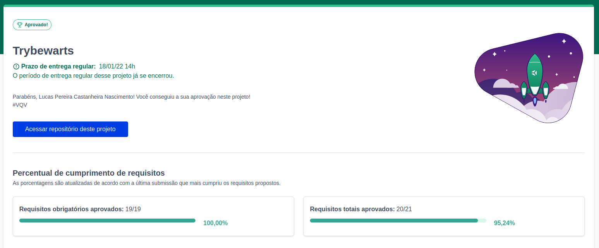
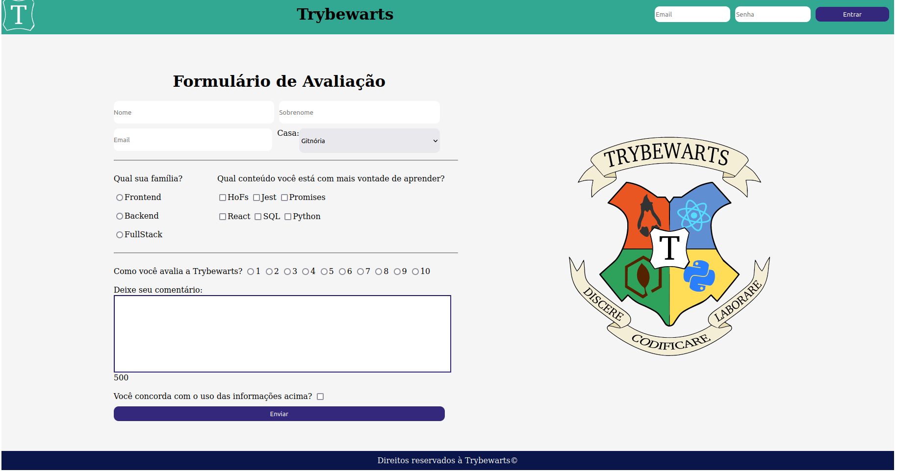

# trybewarts

<h2>:brazil: Português :brazil:</h2>

Projeto entregue durante o curso de desenvolvimento Web ministrado pela <a href="https://www.betrybe.com" targe="_blank" rel="nofollow">Trybe</a>.

Obtive a aprovação no projeto juntamente com o colega <a href="https://github.com/CarlosEdan" target="_blank" rel="external">Carlos Edan</a>, completamos 100% dos requisitos obrigatórios. Efetivando, assim, a conclusão do Bloco 6 (HTML e CSS: Forms, Flexbox e Responsivo) referente ao Módulo 1 (Fundamentos do Desenvolvimento Web).

Descrição:
 

O projeto tinha como objetivo desenvolver uma página de formulário da Escola de Magia de Trybewarts, em que as pessoas estudantes poderão enviar seus feedbacks sobre ela.

Habilidades desenvolvidas

<ol>
<li>Criar formulários em HTML;</li>
<li>Utilizar CSS Flexbox para criar layouts flexíveis;</li>
<li>Criar regras CSS específicas para serem aplicadas a dispositivos móveis;</li>
<li>Construir páginas que alteram o seu layout de acordo com a orientação da tela;</li>
</ol>

Link para conferência: https://lucas-pcn.github.io/trybewarts/

<a href="https://www.linkedin.com/in/lucas-pereira-castanheira-nascimento-238355190/" targe="_blank" rel="nofollow">Meu Linkedin</a>.

 

<h2>:us: English :us:</h2>

Project delivered during the Web development course taught by <a href="https://www.betrybe.com" targe="_blank" rel="nofollow">Trybe</a>.

I got approval on the project together with colleague <a href="https://github.com/CarlosEdan" target="_blank" rel="external">Carlos Edan</a>, we completed 100% of the mandatory requirements. Thus, completing Block 6 (HTML and CSS: Forms, Flexbox and Responsive) referring to Module 1 (Fundamentals of Web Development).

Description:

The project aimed to develop a Trybewarts School of Magic form page, where student people could submit their feedback about it.

Developed skills

<ol>
<li>Create HTML forms;</li>
<li>Use CSS Flexbox to create flexible layouts;</li>
<li>Create specific CSS rules to apply to mobile devices;</li>
<li>Build pages that change their layout according to screen orientation;</li>
</ol>

Conference link: https://lucas-pcn.github.io/trybewarts/

<a href="https://www.linkedin.com/in/lucas-pereira-castanheira-nascimento-238355190/" targe="_blank" rel="nofollow">My Linkedin</a>.

